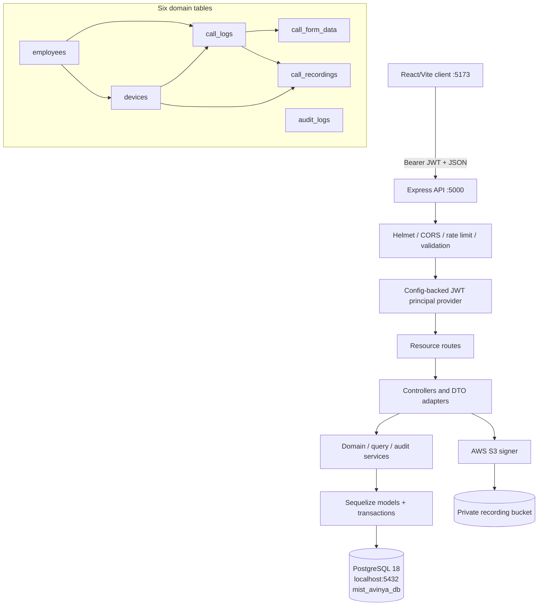
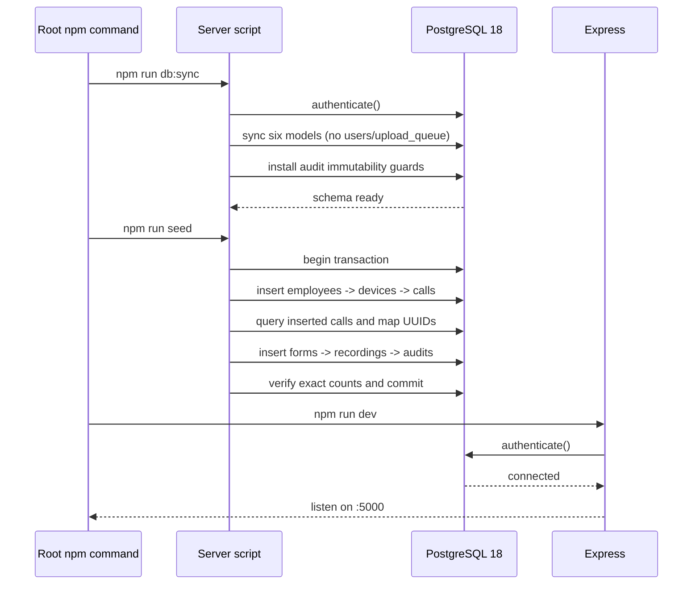
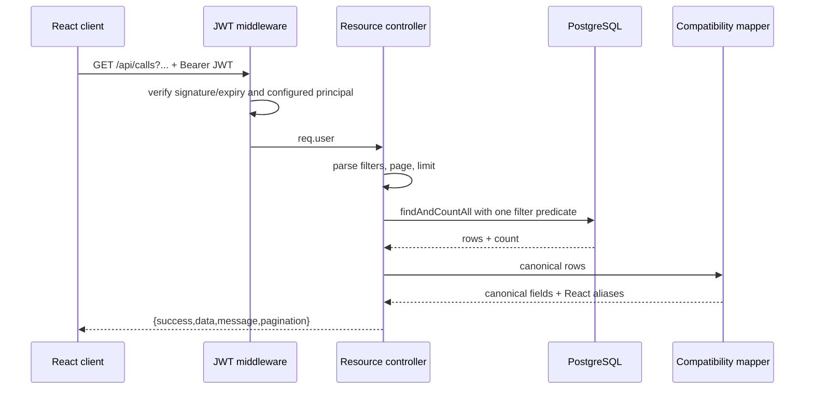
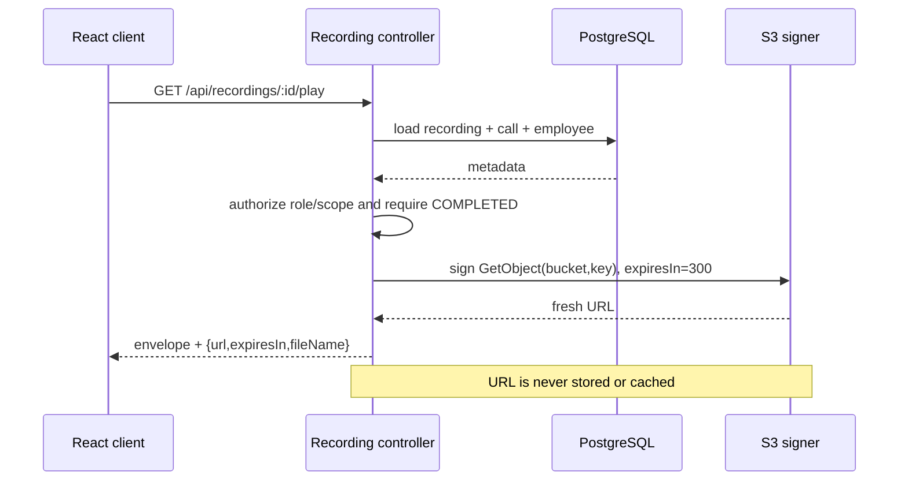
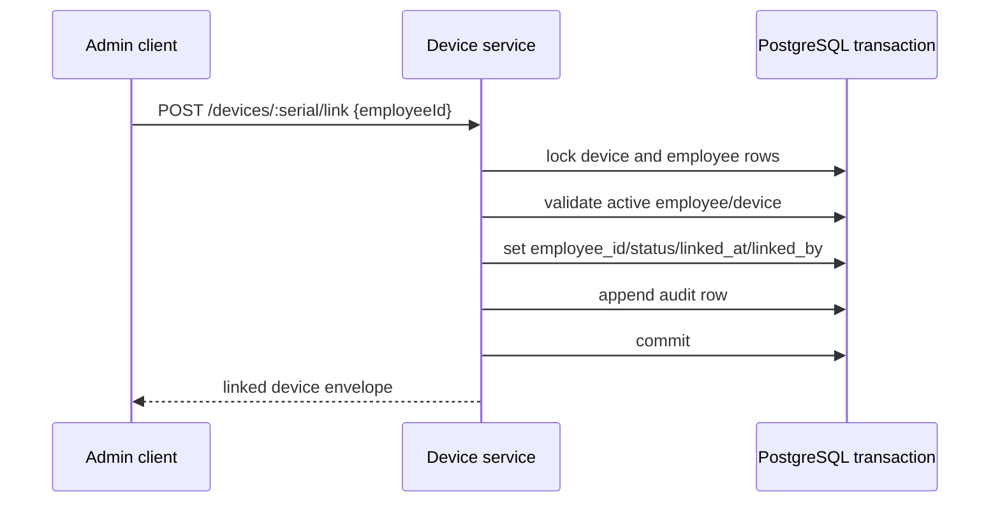

# Design Document: PostgreSQL Call Tracking Migration

## Overview

This migration replaces the Call Tracking Admin Portal's MongoDB/Mongoose persistence with PostgreSQL 18 and Sequelize while retaining the React + Express architecture, ES modules, JWT authentication semantics, role checks, S3 recording playback, and root-level developer commands. The target data layer has exactly six domain tables: `employees`, `devices`, `call_logs`, `call_form_data`, `call_recordings`, and `audit_logs`; there is no `upload_queue`, `users`, or session table.

The active frontend is `client/src/main-live.jsx`, loaded by `client/index.html`. It still consumes Mongo-shaped identifiers and camelCase association fields. The API will therefore expose a temporary compatibility projection in addition to canonical relational fields, inside a standard `{ success, data, message }` envelope. This allows the existing dashboard to remain populated without a simultaneous React rewrite.

Authentication is deliberately outside the six-table domain schema. Authorized admin principals and bcrypt password hashes are loaded from environment configuration, JWTs remain stateless, and the browser retains the token in its existing `localStorage` session. This preserves login, `/auth/me`, bearer-token authorization, role guards, token expiry, and logout behavior without introducing a seventh persistence table.

## Goals and Boundaries

### Goals

- Run PostgreSQL 18 locally at `localhost:5432` with database `mist_avinya_db`, user `postgres`, password `1234`, timezone `+05:30`, and process timezone `Asia/Kolkata`.
- Remove all Mongoose and `express-mongo-sanitize` usage and dependencies; use `sequelize`, `pg`, `pg-hstore`, and `dotenv`.
- Define the complete six-table relational schema, associations, constraints, indexes, enum constants, timestamps, and category behavior.
- Provide complete protected resource APIs with pagination, filters, stats, and consistent response envelopes.
- Preserve the active React dashboard's endpoint and field expectations through server-side DTO adapters.
- Generate fresh, authorization-checked S3 pre-signed playback URLs on demand without caching or persisting URLs.
- Provide deterministic seed cardinalities with dynamic dates and referentially valid UUID mappings.
- Retain existing root scripts while adding `db:sync`, `seed`, and `db:setup`.

### Non-goals

- No React component redesign or state-management rewrite.
- No audio binary storage in PostgreSQL.
- No recording upload worker and no `upload_queue` table.
- No persistent refresh-token/session/revocation store.
- No company or contact domain table; the current `/api/companies` view is derived from `call_form_data` for frontend compatibility.
- No production migration framework in this phase; production deployment should later replace `sequelize.sync` with versioned migrations.

## Architecture



### Runtime layers

1. **Configuration** loads `.env`, validates required values, configures `TZ=Asia/Kolkata`, and creates one Sequelize instance.
2. **Startup** authenticates PostgreSQL before opening the HTTP listener. Startup fails with a non-zero exit if authentication fails.
3. **Security middleware** applies Helmet, a `http://localhost:5173` CORS allowlist, JSON limits, login rate limiting, JWT verification, and role checks.
4. **Route validation** parses bodies, path parameters, and query parameters before controller execution.
5. **Controllers** use `try/catch`, invoke domain/query services, and emit standard envelopes.
6. **Domain services** own transactions and cross-table invariants such as linking devices, category behavior, soft deletion, and append-only audit creation.
7. **DTO adapters** expose canonical fields plus the minimum aliases expected by the active React dashboard.
8. **Error middleware** maps validation, uniqueness, FK, auth, and unexpected errors to safe envelopes.

## Sequence Diagrams

### Startup and local setup



### Authenticated list request



### Recording playback



### Device link operation



## Configuration and Dependency Design

### Environment contract

`server/.env` is rewritten as the local development contract:

```dotenv
DB_HOST=localhost
DB_PORT=5432
DB_NAME=mist_avinya_db
DB_USER=postgres
DB_PASSWORD=1234
DB_DIALECT=postgres
PORT=5000
NODE_ENV=development
TZ=Asia/Kolkata
CLIENT_URL=http://localhost:5173
JWT_SECRET=<development-secret-replaced-in-production>
JWT_EXPIRY=15m
AUTH_USER_ID=<stable-uuid>
AUTH_USER_NAME=MIST Avinya Admin
AUTH_USER_EMAIL=admin@mistavinya.local
AUTH_USER_PASSWORD_HASH=<bcrypt-hash-for-local-admin-password>
AUTH_USER_ROLE=SUPER_ADMIN
AWS_REGION=ap-south-1
AWS_S3_BUCKET=mist-avinya-recordings
AWS_ACCESS_KEY_ID=<local-or-runtime-credential>
AWS_SECRET_ACCESS_KEY=<local-or-runtime-credential>
S3_PLAYBACK_EXPIRY_SECONDS=300
```

The implementation must not log password values, password hashes, JWT secrets, or AWS credentials. Production credentials are runtime secrets and are not committed.

### Package changes

- Remove: `mongoose`, `express-mongo-sanitize` and any MongoDB-only transitive application imports.
- Retain: Express, JWT, bcrypt, Helmet, CORS, rate limiting, Morgan, Zod, AWS S3 SDK.
- Add/retain: `sequelize`, `pg`, `pg-hstore`, `dotenv`.
- Property tests use Node's test runner plus `fast-check` as a pinned development dependency when implementation begins.
- Keep ES module syntax (`"type": "module"`) in server and client packages.

### Root scripts

Existing root scripts remain, with these additions:

```json
{
  "scripts": {
    "dev": "concurrently \"npm run dev --prefix server\" \"npm run dev --prefix client\"",
    "install:all": "npm install && npm install --prefix client && npm install --prefix server",
    "db:sync": "npm run db:sync --prefix server",
    "seed": "npm run seed --prefix server",
    "db:setup": "npm run db:sync && npm run seed"
  }
}
```

The canonical server seed entry is `server/scripts/seed.js`; `server/utils/seed.js` is removed or retained only as a thin compatibility launcher so there is one seed implementation.

## Authentication Persistence Decision

### Decision

Authentication principals are configuration-backed, not database-backed:

```javascript
/** @typedef {'SUPER_ADMIN'|'ADMIN'|'MANAGER'} Role */

/** @typedef {{
 * id: string,
 * name: string,
 * email: string,
 * passwordHash: string,
 * role: Role,
 * active: boolean
 * }} AuthPrincipal */

export interface AuthProvider {
  findByEmail(email) /* Promise<AuthPrincipal|null> */
  findById(id)       /* Promise<AuthPrincipal|null> */
}
```

- `POST /api/auth/login` looks up the configured principal, compares the submitted password with its bcrypt hash, and signs `{ id, role }` using `JWT_SECRET` and `JWT_EXPIRY`.
- Protected middleware verifies the JWT and resolves the same configured principal by stable ID before attaching a password-free `req.user`.
- `GET /api/auth/me` returns the current principal.
- `POST /api/auth/logout` is stateless; the client removes its existing `localStorage` token. No server session row is created.
- A login/logout audit uses `audit_logs.admin_user` and `entity_type='AUTH'`.

### Rationale and trade-off

This preserves current JWT and browser persistence behavior while honoring the exact six-domain-table requirement. It intentionally does not provide server-side token revocation or multi-user administration. A future persistent identity provider can replace `AuthProvider` without changing route/controller contracts, but it is outside this migration.

## Data Models

### Enum constants

Enums are exported once from `server/models/index.js` and reused by models, validators, controllers, seed data, and tests.

```javascript
export const USER_ROLES = ['SUPER_ADMIN', 'ADMIN', 'MANAGER'];
export const DEVICE_LINK_STATUSES = ['UNLINKED', 'AUTO_LINKED', 'MANUAL_LINKED', 'DEACTIVATED'];
export const CALL_DIRECTIONS = ['INCOMING', 'OUTGOING', 'MISSED'];
export const CALL_CATEGORIES = ['CLIENT', 'TEAM_MEMBER', 'PERSONAL', 'MISSED', 'PENDING'];
export const RECORDING_UPLOAD_STATUSES = ['PENDING', 'UPLOADING', 'COMPLETED', 'FAILED', 'RETRY_SCHEDULED'];
export const AUDIT_ACTIONS = [
  'CREATE', 'UPDATE', 'DELETE', 'LOGIN', 'LOGOUT', 'EXPORT',
  'VIEW_EMPLOYEE', 'VIEW_COMPANY', 'VIEW_CALL', 'PLAY_RECORDING',
  'LINK_DEVICE', 'UNLINK_DEVICE'
];
export const AUDIT_ENTITY_TYPES = [
  'AUTH', 'EMPLOYEE', 'DEVICE', 'CALL_LOG', 'CALL_FORM',
  'CALL_RECORDING', 'DASHBOARD', 'SYSTEM'
];
```

### Entity relationship diagram

```mermaid
erDiagram
    EMPLOYEES ||--o{ DEVICES : "may use"
    EMPLOYEES ||--o{ CALL_LOGS : "owns"
    DEVICES ||--o{ CALL_LOGS : "captures"
    CALL_LOGS ||--o| CALL_FORM_DATA : "CLIENT only"
    CALL_LOGS ||--o| CALL_RECORDINGS : "eligible category"
    DEVICES ||--o{ CALL_RECORDINGS : "uploads"

    EMPLOYEES {
      varchar emp_id PK
      varchar full_name
      varchar email UK
      varchar phone_number UK
      varchar designation
      boolean is_active
      timestamptz created_at
      timestamptz updated_at
      timestamptz deleted_at
    }
    DEVICES {
      varchar serial_number PK
      varchar employee_id FK
      varchar imei_1 UK
      varchar imei_2 UK
      varchar phone_number_1 UK
      varchar phone_number_2
      enum link_status
      timestamptz linked_at
      varchar linked_by
      boolean is_active
      timestamptz registered_at
      timestamptz last_seen_at
      timestamptz last_sync_at
      timestamptz created_at
      timestamptz updated_at
    }
    CALL_LOGS {
      uuid id PK
      varchar device_serial FK
      varchar employee_id FK
      enum call_direction
      varchar caller_number
      varchar callee_number
      integer duration_seconds
      enum call_category
      boolean is_form_required
      boolean is_form_submitted
      boolean has_recording
      timestamptz created_at
      timestamptz updated_at
    }
    CALL_FORM_DATA {
      uuid id PK
      uuid call_log_id FK_UK
      varchar company_name
      varchar customer_name
      text reason_for_call
      text notes
      timestamptz created_at
      timestamptz updated_at
    }
    CALL_RECORDINGS {
      uuid id PK
      uuid call_log_id FK_UK
      varchar device_serial FK
      varchar local_file_path
      bigint file_size_bytes
      varchar s3_bucket
      varchar s3_key UK
      enum upload_status
      integer retry_count
      integer max_retries
      timestamptz next_retry_at
      text error_message
      timestamptz created_at
      timestamptz updated_at
    }
    AUDIT_LOGS {
      uuid id PK
      varchar admin_user
      enum action
      enum entity_type
      varchar entity_id
      jsonb old_values
      jsonb new_values
      boolean success
      inet ip_address
      text user_agent
      timestamptz created_at
    }
```

### `employees`

| Column | Type | Rules |
|---|---|---|
| `emp_id` | `VARCHAR(50)` | Primary key, non-null |
| `full_name` | `VARCHAR(255)` | Non-null, trimmed |
| `email` | `VARCHAR(255)` | Non-null, unique, normalized lowercase, email validation |
| `phone_number` | `VARCHAR(20)` | Non-null, unique, E.164 validation |
| `designation` | `VARCHAR(100)` | Non-null |
| `is_active` | `BOOLEAN` | Non-null, default `true` |
| `created_at`, `updated_at` | `TIMESTAMPTZ` | Sequelize timestamps, non-null |
| `deleted_at` | `TIMESTAMPTZ` | Nullable; Sequelize `paranoid: true` soft deletion |

Indexes: unique `email`, unique `phone_number`, `is_active`, `designation`, `deleted_at`, and `(is_active, deleted_at)`.

Soft deletion sets `is_active=false` and `deleted_at` in one transaction. Existing call/device history remains addressable through associations using `paranoid:false` where historical display requires it. Creating a new employee cannot reuse the primary key while a soft-deleted row exists.

### `devices`

| Column | Type | Rules |
|---|---|---|
| `serial_number` | `VARCHAR(50)` | Primary key, non-null |
| `employee_id` | `VARCHAR(50)` | Nullable FK to `employees.emp_id`, `ON UPDATE CASCADE`, `ON DELETE SET NULL` |
| `imei_1` | `VARCHAR(50)` | Non-null, unique |
| `imei_2` | `VARCHAR(50)` | Nullable, unique when present |
| `phone_number_1` | `VARCHAR(20)` | Non-null, unique, E.164 |
| `phone_number_2` | `VARCHAR(20)` | Nullable, E.164 |
| `link_status` | enum | Non-null, default `UNLINKED` |
| `linked_at` | `TIMESTAMPTZ` | Nullable |
| `linked_by` | `VARCHAR(255)` | Nullable; principal email, null for auto-link |
| `is_active` | `BOOLEAN` | Non-null, default `true` |
| `registered_at` | `TIMESTAMPTZ` | Non-null, default current time |
| `last_seen_at`, `last_sync_at` | `TIMESTAMPTZ` | Nullable |
| `created_at`, `updated_at` | `TIMESTAMPTZ` | Non-null Sequelize timestamps |

Indexes: unique IMEI/primary phone constraints, `employee_id`, `link_status`, `is_active`, `last_seen_at`, and `(employee_id, is_active)`.

Link-state checks:

- `UNLINKED`: `employee_id`, `linked_at`, and `linked_by` are null.
- `AUTO_LINKED`: employee and linked timestamp are non-null; `linked_by` is null or `SYSTEM`.
- `MANUAL_LINKED`: employee, linked timestamp, and `linked_by` are non-null.
- `DEACTIVATED`: `is_active=false`; historical employee linkage may be retained.

An employee may have multiple devices. The FK is nullable but not unique; the unique FKs in this schema are the one-to-one `call_log_id` fields below.

### `call_logs`

| Column | Type | Rules |
|---|---|---|
| `id` | `UUID` | Primary key, `UUIDV4` default |
| `device_serial` | `VARCHAR(50)` | Non-null FK to `devices.serial_number`, delete restricted |
| `employee_id` | `VARCHAR(50)` | Non-null FK to `employees.emp_id`, delete restricted |
| `call_direction` | enum | Non-null: `INCOMING`, `OUTGOING`, `MISSED` |
| `caller_number`, `callee_number` | `VARCHAR(20)` | Non-null, E.164 |
| `duration_seconds` | `INTEGER` | Non-null, default `0`, check `>= 0` |
| `call_category` | enum | Non-null, default `PENDING` |
| `is_form_required` | `BOOLEAN` | Non-null, default `false` |
| `is_form_submitted` | `BOOLEAN` | Non-null, default `false` |
| `has_recording` | `BOOLEAN` | Non-null, default `false` |
| `created_at`, `updated_at` | `TIMESTAMPTZ` | Non-null; `created_at` is the call event time |

Indexes: `employee_id`, `device_serial`, `call_direction`, `call_category`, `created_at`, `(employee_id, created_at DESC)`, `(call_category, created_at DESC)`, and partial indexes for pending forms and calls with recordings.

Local checks include `NOT is_form_submitted OR is_form_required`, missed calls having zero duration, and recordings only being marked for eligible categories. Cross-table row existence is enforced transactionally by the domain service and tested as a property.

### Category behavior matrix

| Category | Direction | Form rule | Recording rule | Required flags |
|---|---|---|---|---|
| `CLIENT` | Incoming/outgoing | Exactly one form is required eventually; may be pending | Zero or one recording allowed | `is_form_required=true`; submitted iff form exists; `has_recording` iff recording exists |
| `TEAM_MEMBER` | Incoming/outgoing | Forbidden | Zero or one recording allowed | both form flags false; `has_recording` iff recording exists |
| `PERSONAL` | Incoming/outgoing | Forbidden | Forbidden | all three behavior flags false |
| `MISSED` | `MISSED` | Forbidden | Forbidden | duration `0`; all behavior flags false |
| `PENDING` | Incoming/outgoing | Forbidden until classified | Forbidden until classified | all three behavior flags false |

Category transitions execute in a transaction. A transition to a category that forbids an existing child row is rejected rather than silently deleting evidence.

### `call_form_data`

| Column | Type | Rules |
|---|---|---|
| `id` | `UUID` | Primary key, `UUIDV4` default |
| `call_log_id` | `UUID` | Non-null, unique FK to `call_logs.id`, cascade delete |
| `company_name` | `VARCHAR(255)` | Non-null |
| `customer_name` | `VARCHAR(255)` | Non-null |
| `reason_for_call` | `TEXT` | Non-null |
| `notes` | `TEXT` | Nullable |
| `created_at`, `updated_at` | `TIMESTAMPTZ` | Non-null |

Indexes: unique `call_log_id`, case-insensitive/search index for `company_name`, and `created_at`. The service only inserts a form when the locked parent category is `CLIENT`, then sets `is_form_submitted=true`.

### `call_recordings`

| Column | Type | Rules |
|---|---|---|
| `id` | `UUID` | Primary key, `UUIDV4` default |
| `call_log_id` | `UUID` | Non-null, unique FK to `call_logs.id`, cascade delete |
| `device_serial` | `VARCHAR(50)` | Non-null FK to `devices.serial_number`, delete restricted |
| `local_file_path` | `VARCHAR(500)` | Nullable; cleared after successful upload |
| `file_size_bytes` | `BIGINT` | Non-null, check `>= 0`; serialized safely for JSON |
| `s3_bucket` | `VARCHAR(255)` | Non-null |
| `s3_key` | `VARCHAR(500)` | Non-null, unique |
| `upload_status` | enum | Non-null, default `PENDING` |
| `retry_count` | `INTEGER` | Non-null, default `0`, check `>= 0` |
| `max_retries` | `INTEGER` | Non-null, default `3`, check `>= 0` |
| `next_retry_at` | `TIMESTAMPTZ` | Nullable |
| `error_message` | `TEXT` | Nullable |
| `created_at`, `updated_at` | `TIMESTAMPTZ` | Non-null |

Indexes: unique `call_log_id`, unique `s3_key`, `device_serial`, `upload_status`, `next_retry_at`, and `(upload_status, updated_at DESC)`.

Only `CLIENT` and `TEAM_MEMBER` calls may own recordings. Playback requires `COMPLETED`; failed/pending/uploading/retry-scheduled records never receive a URL.

### `audit_logs`

| Column | Type | Rules |
|---|---|---|
| `id` | `UUID` | Primary key, `UUIDV4` default |
| `admin_user` | `VARCHAR(255)` | Non-null configured principal email/name |
| `action` | enum | Non-null |
| `entity_type` | enum | Non-null |
| `entity_id` | `VARCHAR(255)` | Non-null |
| `old_values`, `new_values` | `JSONB` | Nullable; secrets excluded |
| `success` | `BOOLEAN` | Non-null, default `true` |
| `ip_address` | `INET` | Non-null |
| `user_agent` | `TEXT` | Non-null |
| `created_at` | `TIMESTAMPTZ` | Non-null, default current time |

Indexes: `admin_user`, `action`, `entity_type`, `entity_id`, `success`, `created_at DESC`, and `(entity_type, entity_id, created_at DESC)`.

`timestamps:false` is used except for explicit `created_at`; no `updated_at` exists. Sequelize `beforeUpdate`, `beforeDestroy`, and bulk equivalents reject mutation. `db:sync` also installs PostgreSQL guards rejecting `UPDATE`, `DELETE`, and `TRUNCATE`, so append-only behavior does not depend solely on controllers. Seed requires an empty/new schema rather than deleting prior audit evidence.

## Associations

```javascript
Employee.hasMany(Device, { foreignKey: 'employee_id', as: 'devices' });
Device.belongsTo(Employee, { foreignKey: 'employee_id', as: 'employee' });

Employee.hasMany(CallLog, { foreignKey: 'employee_id', as: 'callLogs' });
CallLog.belongsTo(Employee, { foreignKey: 'employee_id', as: 'employee' });

Device.hasMany(CallLog, { foreignKey: 'device_serial', as: 'callLogs' });
CallLog.belongsTo(Device, { foreignKey: 'device_serial', as: 'device' });

CallLog.hasOne(CallFormData, { foreignKey: 'call_log_id', as: 'callForm' });
CallFormData.belongsTo(CallLog, { foreignKey: 'call_log_id', as: 'callLog' });

CallLog.hasOne(CallRecording, { foreignKey: 'call_log_id', as: 'recording' });
CallRecording.belongsTo(CallLog, { foreignKey: 'call_log_id', as: 'callLog' });

Device.hasMany(CallRecording, { foreignKey: 'device_serial', as: 'recordings' });
CallRecording.belongsTo(Device, { foreignKey: 'device_serial', as: 'device' });
```

Association aliases are stable API/query contracts. Controllers do not duplicate manual join logic.

## Components and Interfaces

### Database configuration

```javascript
export interface DatabaseModule {
  sequelize: Sequelize
  connectDB(): Promise<Sequelize>
  syncDB(options?: { force?: boolean, alter?: boolean }): Promise<void>
  closeDB(): Promise<void>
  installAuditImmutability(): Promise<void>
}
```

Sequelize configuration:

```javascript
{
  dialect: 'postgres',
  host: process.env.DB_HOST,
  port: Number(process.env.DB_PORT),
  timezone: '+05:30',
  pool: { min: 2, max: 10, acquire: 30000, idle: 10000 },
  define: { timestamps: true, underscored: true },
  logging: process.env.NODE_ENV === 'development' ? console.log : false
}
```

PostgreSQL stores `TIMESTAMPTZ` instants; the application calculates calendar boundaries in `Asia/Kolkata` and emits ISO timestamps.

### Envelope and pagination types

```javascript
/** @template T */
export const success = (data, message, pagination) => ({
  success: true,
  data,
  message,
  ...(pagination && { pagination })
});

export const failure = (message, data = null) => ({
  success: false,
  data,
  message
});

/** @typedef {{page:number, limit:number, total:number, pages:number}} Pagination */
```

List endpoints always include `pagination`, including empty results (`pages: 0`). Page defaults to `1`; limit defaults to `20` and is clamped to `1..200` for the current dashboard's `limit=200` requests.

### Controller contracts

```javascript
export interface EmployeeController {
  list(req, res): Promise<Response>
  detail(req, res): Promise<Response>
  create(req, res): Promise<Response>
  update(req, res): Promise<Response>
  remove(req, res): Promise<Response>
  stats(req, res): Promise<Response>
}

export interface DeviceController {
  list(req, res): Promise<Response>
  detail(req, res): Promise<Response>
  create(req, res): Promise<Response>
  update(req, res): Promise<Response>
  remove(req, res): Promise<Response>
  link(req, res): Promise<Response>
  unlink(req, res): Promise<Response>
  stats(req, res): Promise<Response>
}

export interface CallController {
  list(req, res): Promise<Response>
  detail(req, res): Promise<Response>
  stats(req, res): Promise<Response>
  recent(req, res): Promise<Response>
}

export interface FormController {
  list(req, res): Promise<Response>
  detail(req, res): Promise<Response>
  pending(req, res): Promise<Response>
}

export interface RecordingController {
  list(req, res): Promise<Response>
  detail(req, res): Promise<Response>
  play(req, res): Promise<Response>
  stats(req, res): Promise<Response>
  failed(req, res): Promise<Response>
}

export interface AuditController {
  list(req, res): Promise<Response>
  stats(req, res): Promise<Response>
}

export interface DashboardController {
  summary(req, res): Promise<Response>
  activity(req, res): Promise<Response>
}
```

Every async controller has a top-level `try/catch` and forwards normalized unexpected errors to error middleware. Services throw typed operational errors; controllers do not expose SQL or stack traces outside development.

## API Design

Static routes such as `/stats`, `/recent`, `/pending`, and `/failed` are registered before `/:id` routes.

### Authentication

| Method | Endpoint | Access | Behavior |
|---|---|---|---|
| `POST` | `/api/auth/login` | Public + rate limited | Validate email/password, issue JWT, audit login |
| `GET` | `/api/auth/me` | Authenticated | Return configured principal without hash |
| `POST` | `/api/auth/logout` | Authenticated | Append logout audit and return success envelope |

For compatibility with the current login code, the login response temporarily mirrors `token` and `user` at the top level while also placing them in `data`:

```javascript
{
  success: true,
  data: { token, user },
  message: 'Login successful',
  token,
  user
}
```

### Employees

| Method | Endpoint | Filters/body |
|---|---|---|
| `GET` | `/api/employees` | `page`, `limit`, `q`, `designation`, `isActive` |
| `GET` | `/api/employees/stats` | optional date range |
| `GET` | `/api/employees/:empId` | detail with device/call aggregates |
| `POST` | `/api/employees` | create validated employee |
| `PATCH` | `/api/employees/:empId` | update mutable fields |
| `DELETE` | `/api/employees/:empId` | soft delete/deactivate |

### Devices

| Method | Endpoint | Filters/body |
|---|---|---|
| `GET` | `/api/devices` | `page`, `limit`, `q`, `employeeId`, `linkStatus`, `isActive` |
| `GET` | `/api/devices/stats` | counts by state and recent sync |
| `GET` | `/api/devices/:serialNumber` | detail with employee |
| `POST` | `/api/devices` | create device |
| `PATCH` | `/api/devices/:serialNumber` | metadata/status update |
| `DELETE` | `/api/devices/:serialNumber` | deactivate, never erase referenced history |
| `POST` | `/api/devices/:serialNumber/link` | `{ employeeId, mode? }` |
| `POST` | `/api/devices/:serialNumber/unlink` | clear employee/link metadata |

### Calls

| Method | Endpoint | Filters |
|---|---|---|
| `GET` | `/api/calls` | `page`, `limit`, `q`, `employee`/`employeeId`, `device`, `direction`, `category`, `classification`, `company`, `recordingStatus`, `formStatus`, `from`, `to` |
| `GET` | `/api/calls/stats` | same filter domain without pagination |
| `GET` | `/api/calls/recent` | `limit` plus optional employee/category |
| `GET` | `/api/calls/:id` | full employee/device/form/recording detail |

Filter aliases preserve the client contract:

- `classification=BUSINESS` maps to `call_category IN (CLIENT, TEAM_MEMBER)`.
- `classification=PERSONAL` maps to `call_category=PERSONAL`.
- `company` filters the joined form's company identifier/name.
- `recordingStatus=HAS_RECORDING|NONE|UPLOADED|PENDING|FAILED` maps to relational recording predicates; `UPLOADED` maps to `COMPLETED`.
- Date filters are inclusive, validated, and interpreted as Asia/Kolkata day boundaries when date-only strings are supplied.

### Forms

| Method | Endpoint | Filters |
|---|---|---|
| `GET` | `/api/forms` | `page`, `limit`, `q`, `employeeId`, `company`, `from`, `to` |
| `GET` | `/api/forms/pending` | paginated CLIENT calls with required but unsubmitted forms |
| `GET` | `/api/forms/:id` | form detail with call/employee/device |

### Recordings

| Method | Endpoint | Filters |
|---|---|---|
| `GET` | `/api/recordings` | `page`, `limit`, `q`, `employeeId`, `device`, `status`, `from`, `to` |
| `GET` | `/api/recordings/stats` | counts/bytes by status |
| `GET` | `/api/recordings/failed` | paginated failed/retry-exhausted records |
| `GET` | `/api/recordings/:id` | metadata detail; no URL |
| `GET` | `/api/recordings/:id/play` | fresh 300-second pre-signed URL |

### Audit

| Method | Endpoint | Filters |
|---|---|---|
| `GET` | `/api/audit-logs` | `page`, `limit`, `adminUser`, `action`, `entityType`, `entityId`, `success`, `from`, `to` |
| `GET` | `/api/audit-logs/stats` | counts by action/entity/success |

No create/update/delete audit route exists.

### Dashboard and compatibility view

| Method | Endpoint | Behavior |
|---|---|---|
| `GET` | `/api/dashboard` | employee/call/client/recording/duration/form KPIs |
| `GET` | `/api/dashboard/activity` | recent calls, audits, failed uploads, pending forms |
| `GET` | `/api/companies` | read-only paginated distinct company projection derived from forms |

`/api/companies` does not introduce a seventh table. It groups normalized `company_name`, supplies customer/contact fields from the most recent form, and derives the assigned salesperson and call count through `call_logs`.

## React Compatibility DTOs

Canonical fields remain available; aliases satisfy `client/src/main-live.jsx` until the frontend is migrated.

### Employee DTO

```javascript
{
  id: employee.emp_id,
  _id: employee.emp_id,
  emp_id: employee.emp_id,
  employeeId: employee.emp_id,
  full_name: employee.full_name,
  name: employee.full_name,
  email: employee.email,
  phone_number: employee.phone_number,
  phone: employee.phone_number,
  designation: employee.designation,
  department: employee.designation,
  is_active: employee.is_active,
  status: employee.is_active ? 'ACTIVE' : 'INACTIVE'
}
```

### Call DTO

```javascript
{
  id: call.id,
  _id: call.id,
  callId: call.id,
  employee_id: call.employee_id,
  employeeId: employee && { _id: employee.emp_id, name: employee.full_name },
  device_serial: call.device_serial,
  direction: call.call_direction,
  startTime: call.created_at,
  duration: call.duration_seconds,
  classification: ['CLIENT', 'TEAM_MEMBER'].includes(call.call_category)
    ? 'BUSINESS'
    : call.call_category,
  companyId: form && { _id: form.id, name: form.company_name },
  recordingId: recording && {
    _id: recording.id,
    uploadStatus: toClientUploadStatus(recording.upload_status)
  }
}
```

Upload mapping: `COMPLETED -> UPLOADED`, `PENDING|UPLOADING|RETRY_SCHEDULED -> PENDING`, `FAILED -> FAILED`.

### Recording DTO

```javascript
{
  id: recording.id,
  _id: recording.id,
  employeeId: { _id: employee.emp_id, name: employee.full_name },
  callId: { _id: call.id, callId: call.id, startTime: call.created_at },
  fileName: basename(recording.s3_key),
  fileSize: Number(recording.file_size_bytes),
  uploadStatus: toClientUploadStatus(recording.upload_status),
  uploadedAt: recording.upload_status === 'COMPLETED' ? recording.updated_at : null
}
```

### Audit DTO

```javascript
{
  id: audit.id,
  _id: audit.id,
  timestamp: audit.created_at,
  userId: { _id: audit.admin_user, name: audit.admin_user },
  action: audit.action,
  resourceId: audit.entity_id,
  success: audit.success
}
```

### Company compatibility DTO

```javascript
{
  id: normalizedCompanyKey,
  _id: normalizedCompanyKey,
  name: latestForm.company_name,
  contactPerson: latestForm.customer_name,
  phone: null,
  email: null,
  industry: null,
  location: null,
  assignedSalesperson: employee && {
    _id: employee.emp_id,
    name: employee.full_name
  },
  totalCalls
}
```

Fields unavailable in the six-table schema are explicitly `null` rather than fabricated. The active client already renders these values with an em dash.

### Compatibility response aliases

The canonical list envelope is `{ success, data, message, pagination }`. During the compatibility window, `page`, `pages`, and `total` are also mirrored from `pagination` at the top level for older API consumers. Every list-style endpoint, including calls `recent`, forms `pending`, recordings `failed`, companies, and dashboard `activity`, accepts `page` and `limit` and returns this pagination contract.

Playback retains the envelope and mirrors the fields read directly by the active audio component:

```javascript
{
  success: true,
  data: { url, expiresIn: 300, fileName },
  message: 'Playback URL generated',
  url,
  expiresIn: 300,
  fileName
}
```

This compatibility layer is presentation-only; it does not recreate MongoDB semantics in the persistence layer.

## Key Functions with Formal Specifications

### `parsePagination(query)`

```javascript
function parsePagination(query) /* -> { page, limit, offset } */
```

**Preconditions**
- `query` is an object; values may be absent or untrusted strings.

**Postconditions**
- `page` is an integer `>= 1`.
- `limit` is an integer in `[1, 200]`.
- `offset === (page - 1) * limit` and is non-negative.
- Invalid values use defaults rather than reaching Sequelize.

**Loop invariants**: N/A.

### `buildCallWhere(filters)`

```javascript
function buildCallWhere(filters) /* -> SequelizeWhereAndIncludes */
```

**Preconditions**
- Filters have passed enum/date/identifier validation.

**Postconditions**
- Every supplied filter contributes an `AND` predicate.
- Omitted filters do not restrict results.
- Search terms are parameterized through Sequelize operators.
- Company and recording filters use required joins only when needed.
- The same predicate object is used for rows and count.

**Loop invariants**
- After processing the first `k` filter entries, the predicate represents the conjunction of exactly those `k` active filters.

### `linkDevice(serialNumber, employeeId, actor, mode)`

```javascript
async function linkDevice(serialNumber, employeeId, actor, mode = 'MANUAL_LINKED')
```

**Preconditions**
- Actor has `SUPER_ADMIN` or `ADMIN` role.
- Device and employee exist and are active.
- Mode is `AUTO_LINKED` or `MANUAL_LINKED`.

**Postconditions**
- Device references the employee.
- Link status, timestamp, and `linked_by` match the state rules.
- Exactly one append-only audit event is added.
- Either all changes commit or none do.

**Loop invariants**: N/A; row locks serialize competing link operations.

### `softDeleteEmployee(empId, actor)`

```javascript
async function softDeleteEmployee(empId, actor)
```

**Preconditions**
- Employee exists and is not already deleted.
- Actor is authorized.

**Postconditions**
- `is_active=false` and `deleted_at` is non-null.
- Existing call history and devices remain valid.
- Default employee lists no longer return the employee.
- An audit row captures the prior and resulting state.

**Loop invariants**: N/A.

### `applyCategoryTransition(callId, nextCategory)`

```javascript
async function applyCategoryTransition(callId, nextCategory)
```

**Preconditions**
- Call exists and `nextCategory` is a declared category.

**Postconditions**
- The resulting call and child rows satisfy the behavior matrix.
- Existing forbidden child evidence causes conflict; it is not silently deleted.
- Flags equal child-row existence after commit.

**Loop invariants**: N/A; the parent and child rows are locked in one transaction.

### `createAuditEvent(event, transaction)`

```javascript
async function createAuditEvent(event, transaction)
```

**Preconditions**
- Required action/entity/actor/request metadata is present.
- Secrets and password material have been removed from snapshots.

**Postconditions**
- Exactly one immutable event is appended in the caller's transaction.
- No existing audit row is updated or deleted.

**Loop invariants**: N/A.

### `createPlaybackUrl(recordingId, actor)`

```javascript
async function createPlaybackUrl(recordingId, actor)
```

**Preconditions**
- Actor is authenticated and authorized for recordings.

**Postconditions**
- Missing or non-completed recording returns a not-found/unavailable error.
- Success signs the persisted bucket/key for exactly the configured short expiry.
- No URL is persisted or cached.
- A playback audit event is appended.

**Loop invariants**: N/A.

### `seedDatabase(now)`

```javascript
async function seedDatabase(now = new Date())
```

**Preconditions**
- All six tables are empty/new; seed aborts without partial changes otherwise.
- Schema and immutability guards exist.

**Postconditions**
- Exactly 8 employees, 6 devices, 20 calls, 12 forms, 15 recordings, and 10 audits exist.
- Calls occupy all required relative-day buckets: today, yesterday, 3, 5, and 7 days ago in Asia/Kolkata.
- Forms and recordings reference queried inserted call UUIDs.
- S3 keys use dates derived from each call, not hard-coded historical dates.
- The transaction commits only after exact count and invariant checks pass.

**Loop invariants**
- During each bulk preparation loop, every prepared child references a parent already inserted in the current transaction.
- After processing `k` calls, each call's relative-day bucket and category flags satisfy the matrix.

## Seed Design

Seed order honors FKs:

1. Begin one transaction and assert all six domain tables are empty.
2. Insert exactly 8 employees.
3. Insert exactly 6 devices, including linked and unlinked states.
4. Build 20 calls using `startOfDay(now, Asia/Kolkata) - [0,1,3,5,7] days`; distribute at least one call in every bucket.
5. Insert calls, then query the inserted call rows within the transaction and build a UUID map from the returned records. Child fixtures never assume insertion order or stale UUIDs.
6. Select 12 `CLIENT` calls and insert exactly 12 forms.
7. Select 15 eligible `CLIENT`/`TEAM_MEMBER` calls and insert exactly 15 recordings with a mix of `COMPLETED`, `PENDING`/`UPLOADING`, and `FAILED` statuses.
8. Build each S3 key as `recordings/{employeeId}/{yyyy}/{MM}/{dd}/{callUuid}.m4a` from that call's dynamic date.
9. Insert exactly 10 audit rows last.
10. Re-query counts and behavior invariants, then commit; rollback on any mismatch.

A valid category allocation is 12 CLIENT, 3 TEAM_MEMBER, and 5 across PERSONAL/MISSED/PENDING. This supports 12 forms and 15 eligible recordings without violating the matrix.

## Algorithmic Workflows

### Paginated query workflow

```javascript
async function listResource({ model, filters, include, query, mapper }) {
  const { page, limit, offset } = parsePagination(query);
  const predicate = buildPredicate(filters);

  const { rows, count } = await model.findAndCountAll({
    where: predicate.where,
    include: mergeIncludes(include, predicate.includes),
    order: [['created_at', 'DESC']],
    limit,
    offset,
    distinct: true,
    subQuery: false
  });

  return success(
    rows.map(mapper),
    'Records retrieved',
    { page, limit, total: count, pages: Math.ceil(count / limit) }
  );
}
```

`distinct:true` prevents joined one-to-one/one-to-many rows from inflating pagination counts.

### Pending-form query

```javascript
async function listPendingForms(query) {
  return listCalls({
    ...query,
    where: {
      call_category: 'CLIENT',
      is_form_required: true,
      is_form_submitted: false
    },
    include: [{ association: 'callForm', required: false }],
    additionalPredicate: { '$callForm.id$': null }
  });
}
```

### Dashboard aggregation

```javascript
async function getDashboardSummary(range) {
  const [employees, calls, clientCalls, duration, recordings, pendingForms] =
    await Promise.all([
      countActiveEmployees(),
      countCalls(range),
      countCalls(range, { call_category: 'CLIENT' }),
      sumCallDuration(range),
      countRecordings(range, { upload_status: 'COMPLETED' }),
      countPendingForms(range)
    ]);

  return { employees, calls, clientCalls, durationSeconds: duration, recordings, pendingForms };
}
```

## Correctness Properties

The following are implementation-independent properties suitable for `fast-check` model/command tests and PostgreSQL integration properties.

### Property 1: Relationship integrity

**Validates: Requirements 2.1**

For every persisted device with non-null `employee_id`, exactly one employee with that key exists. For every call, its employee and device exist. For every form/recording, exactly one parent call exists.

### Property 2: One-to-one child integrity

**Validates: Requirements 2.2**

For all call IDs, the number of forms is at most one and the number of recordings is at most one.

### Property 3: Category matrix

**Validates: Requirements 3.1**

For every call in every valid database state, its direction, duration, flags, form existence, and recording existence satisfy the category behavior matrix.

### Property 4: Form eligibility

**Validates: Requirements 3.2**

For every form, its parent category is `CLIENT`, the parent has `is_form_required=true`, and `is_form_submitted=true`.

### Property 5: Recording eligibility

**Validates: Requirements 3.3**

For every recording, its parent category belongs to `{CLIENT, TEAM_MEMBER}`, the recording device equals the parent call device, and `has_recording=true`.

### Property 6: Flag equivalence

**Validates: Requirements 3.4**

For every call after a committed domain operation, `is_form_submitted` iff a form exists and `has_recording` iff a recording exists.

### Property 7: Pagination partition

**Validates: Requirements 4.1**

For any valid filter and positive limit, concatenating all pages returns each matching row exactly once in the declared order, and the reported total equals the filtered database count.

### Property 8: Pagination bounds

**Validates: Requirements 4.2**

For all untrusted page/limit inputs, resulting page is at least one, limit is in `[1,200]`, and offset is non-negative.

### Property 9: Filter soundness

**Validates: Requirements 4.3**

Every row returned for a filter satisfies every active predicate.

### Property 10: Filter completeness

**Validates: Requirements 4.4**

Every row satisfying all active predicates appears on exactly one page before concurrent mutation.

### Property 11: Compatibility classification

**Validates: Requirements 5.1**

For every call, client classification is `BUSINESS` iff category is CLIENT or TEAM_MEMBER; PERSONAL maps to PERSONAL.

### Property 12: Compatibility upload status

**Validates: Requirements 5.2**

Every internal recording status maps deterministically to exactly one client status and never exposes a completed recording as pending/failed.

### Property 13: Soft deletion

**Validates: Requirements 2.3**

For every successfully deleted employee, default reads exclude it, historical call joins still resolve it, and no physical employee/call/device row is removed.

### Property 14: Audit append-only

**Validates: Requirements 6.1**

For every state transition from audit state `A` to `A'`, `A` is a prefix/subset of `A'`; existing audit row values never change, and update/delete/truncate attempts fail.

### Property 15: Audit atomicity

**Validates: Requirements 6.2**

For every audited domain command, either the domain mutation and one audit row both commit, or neither commits.

### Property 16: Playback eligibility

**Validates: Requirements 7.1**

A playback URL is returned iff the actor is authorized and the recording exists with status `COMPLETED`.

### Property 17: Playback non-caching

**Validates: Requirements 7.2**

Successful playback requests never modify database rows or store the signed URL; URL expiry equals the configured value.

### Property 18: Envelope consistency

**Validates: Requirements 4.5**

Every API response with a body has boolean `success`, a `data` member, and a string `message`; every list success additionally has valid pagination.

### Property 19: Seed cardinality

**Validates: Requirements 8.1**

After a successful seed on an empty schema, table counts are exactly `8/6/20/12/15/10` in declared order.

### Property 20: Seed date spreading

**Validates: Requirements 8.2**

Relative to the seed invocation's Asia/Kolkata date, the 20 calls include all day offsets `{0,1,3,5,7}` and no hard-coded calendar date is required.

### Property 21: Seed FK mapping

**Validates: Requirements 8.3**

Every seeded form/recording UUID belongs to the set obtained by querying the just-inserted calls, not an assumed array index or stale fixture ID.

### Property 22: Seed key/date agreement

**Validates: Requirements 8.4**

For every seeded recording, its S3 key date segments equal the associated call's Asia/Kolkata calendar date.

### Property 23: Transaction rollback

**Validates: Requirements 8.5**

For every injected seed or domain failure, no partial rows from that transaction become visible.

### Property 24: Exactly-six schema

**Validates: Requirements 1.1**

After sync, the application-owned domain table set equals the six declared names and excludes `users`, `user_sessions`, and `upload_queue`.

## Error Handling

| Condition | Status | Message behavior |
|---|---:|---|
| Invalid body/query/path | `400` | First actionable validation message; no SQL details |
| Missing/invalid/expired JWT | `401` | Generic authentication message |
| Insufficient role/scope | `403` | Generic permission message |
| Missing resource/unavailable recording | `404` | Resource-specific safe message |
| Unique/link/category conflict | `409` | Stable conflict message and code |
| Rate limit | `429` | Retry message |
| Unexpected DB/S3/server failure | `500` | Generic message; detailed server log only |

Sequelize validation, unique, and FK errors are normalized centrally. CORS failures, malformed JSON, and async errors also use the standard failure envelope when a response body is possible.

## Testing Strategy

### Unit tests

- Environment validation and Sequelize option construction.
- Pagination parsing, date boundary conversion, filter aliases, and enum validation.
- Category transition rules and DTO compatibility mappings.
- Envelope/error mapping and sensitive-field redaction.
- S3 signer inputs and playback authorization using a mocked signer.
- Auth provider lookup, bcrypt comparison, JWT payload, expiry, and role guard.

### Property-based tests

Use `fast-check` with Node's test runner for pagination arithmetic, filter composition, DTO mappings, category state transitions, envelope shape, date spreading, and S3 key/date agreement. Stateful command models cover device link/unlink, form submission, category transitions, soft delete, and immutable audit history.

### PostgreSQL integration tests

- Sync a disposable PostgreSQL schema and assert exactly six application tables, FKs, uniqueness, checks, indexes, and audit guards.
- Exercise all endpoints against generated relational data.
- Verify transactions and row locks under conflicting link/category operations.
- Run seed on an empty schema and verify exact counts, dates, child mappings, and rollback on an injected failure.
- Attempt raw Sequelize update/delete/truncate operations against audit logs and assert rejection.

### API/React contract tests

- Login through the active client's expected top-level `token`/`user` aliases.
- Verify employees, calls, companies, recordings, and audits expose every field read by `main-live.jsx`.
- Verify `GET /calls?limit=200` and other active URLs return arrays under top-level response `data` plus pagination.
- Verify playback returns a `url` field usable by the existing `<audio>` element.
- Build the client after server changes to detect accidental contract drift.

### Smoke validation

From the repository root on a clean local database:

```text
npm run db:sync
npm run seed
npm run dev
```

Expected state: API on `5000`, Vite on `5173`, successful login, populated dashboard/list pages, PostgreSQL-backed filters, and playback responses for completed fixtures.

## Performance Considerations

- Pool size is fixed at minimum 2 and maximum 10 connections.
- Every list is bounded to 200 rows and uses indexed predicates and deterministic ordering.
- `findAndCountAll` uses `distinct:true` when joins are present.
- Controllers select only required association attributes; password material never enters resource queries.
- Dashboard aggregates run in parallel and use database `COUNT`/`SUM`, not in-memory scans.
- Search uses escaped `ILIKE`; if data volume grows, add PostgreSQL trigram indexes in a later migration rather than changing the API.
- Pre-signed URLs are intentionally not cached; metadata queries remain indexed by recording primary key/status.
- BIGINT byte values are converted safely to JSON numbers only when within safe range, otherwise serialized as strings in canonical output.

## Security Considerations

- Only `http://localhost:5173` is allowed by local CORS configuration; credentials and authorization headers are explicit.
- Login remains rate limited; Helmet and request size limits remain enabled.
- JWTs are short-lived and signed with runtime secrets. Passwords are compared only as bcrypt hashes.
- Configured principals never expose `passwordHash` through DTOs or logs.
- All SQL is generated through Sequelize operators/bind parameters; sort fields and enum filters use allowlists.
- S3 objects remain private; only authorized, completed recordings receive short-lived URLs.
- Audit snapshots redact passwords, JWTs, AWS secrets, signed URLs, and authorization headers.
- Audit database guards prevent controller bypass from mutating history.
- Production uses SSL database options and runtime-managed AWS credentials; development values do not define production policy.

## Dependencies

| Dependency | Design responsibility |
|---|---|
| PostgreSQL 18 | Relational persistence, constraints, indexes, transactions, JSONB, and audit immutability guards |
| Sequelize 6 | ES-module ORM models, associations, parameterized queries, pooling, and transactions |
| `pg` / `pg-hstore` | PostgreSQL driver and Sequelize dialect support |
| `dotenv` | Local configuration loading before database/auth initialization |
| Express | HTTP routing and middleware pipeline |
| Zod | Request body, parameter, query, and environment validation |
| `jsonwebtoken` / `bcryptjs` | Stateless JWT authentication and configured password-hash comparison |
| Helmet / CORS / express-rate-limit | HTTP hardening, origin allowlist, and login throttling |
| AWS S3 SDK / request presigner | Private object access through fresh, short-lived playback URLs |
| React / Vite | Existing client consuming compatibility DTOs on port 5173 |
| `fast-check` + Node test runner | Property-based and unit testing during implementation |

No MongoDB driver, Mongoose model, Mongo sanitization middleware, or upload queue dependency remains in the target runtime.

## Migration and Rollout

1. Update package manifests and lockfiles, removing Mongo-only dependencies.
2. Rewrite `.env` and database configuration; validate PostgreSQL connectivity.
3. Define six models, constraints, indexes, associations, and audit guards.
4. Replace Mongo-shaped auth persistence with the config-backed provider while retaining JWT behavior.
5. Rewrite services/controllers/routes and add envelope/compatibility DTOs.
6. Consolidate sync/seed scripts and add root command passthroughs.
7. Run schema, unit, property, integration, API contract, and client build checks.
8. Execute root `db:sync`, `seed`, and non-watch smoke startup locally.

Rollback before production cutover consists of restoring the previous package/config/server files and reconnecting the prior MongoDB environment. PostgreSQL schema creation is additive to the local database; no Mongo source data is destroyed by this migration design.

## File Impact

Implementation is expected to rewrite or add only the appropriate application files, including:

- Root `package.json` and lockfile scripts/dependency resolution.
- `server/package.json`, `server/.env`, and example environment configuration.
- `server/config/db.js`.
- `server/models/index.js`.
- `server/src.js`.
- All route/controller modules, with resource separation permitted.
- `server/middleware/auth.js`, `server/middleware/audit.js`, validation, and error middleware.
- `server/services/s3.js` plus domain/query/DTO/auth services as needed.
- `server/scripts/sync-db.js` and canonical seed script; duplicate seed logic is eliminated.

No application code is changed during this design phase.