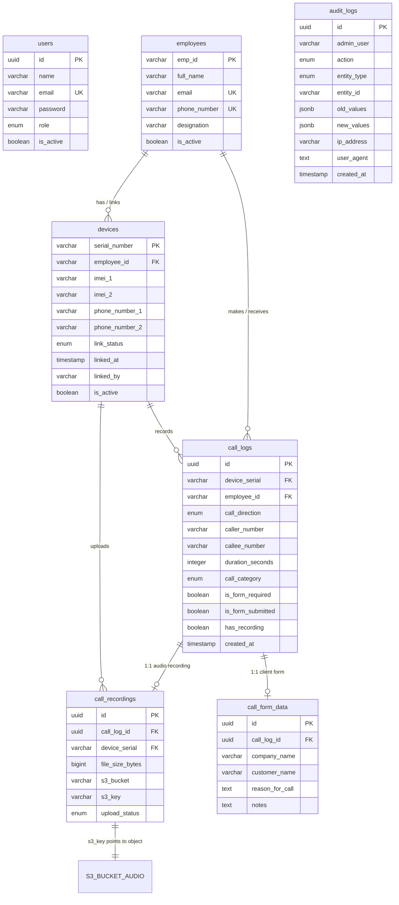

# AWS RDS (PostgreSQL) & AWS S3 Data Specification Guide

This specification defines the exact **PostgreSQL database schema**, **table relationships**, and **AWS S3 audio storage layout** required for the application to seamlessly fetch and stream real data from AWS.

---

## 🏛️ 1. Entity Relationship (ER) & S3 Linkage Diagram



---

## 📦 2. AWS S3 Audio Storage Architecture

### S3 Bucket Layout & Naming Convention
Audio files recorded by mobile devices are organized in the S3 bucket using the canonical employee, date, and call-partitioned path:

```
s3://<your-s3-bucket-name>/
│
└── recordings/
    └── {empId}/
        └── {YYYY}/
            └── {MM}/
                └── {DD}/
                    └── {callId}/
                        └── {fileName}
```

#### Example S3 Object:
- **Bucket**: `mist-avinya-recordings`
- **S3 Key**: `recordings/EMP-001/2026/09/11/9b1deb4d-3b7d-4bad-9bdd-2b0d7b3dcb6d/audio.m4a`
- **MIME Type**: `audio/mp4` or `audio/m4a`
- **Key Parameters**:
  - `{empId}`: Unique Employee ID (e.g. `EMP-001`)
  - `{YYYY}`: 4-digit Year (e.g. `2026`)
  - `{MM}`: 2-digit Month (e.g. `09`)
  - `{DD}`: 2-digit Day (e.g. `11`)
  - `{callId}`: Unique Call Log UUID (e.g. `9b1deb4d-3b7d-4bad-9bdd-2b0d7b3dcb6d`)
  - `{fileName}`: Audio filename with extension (e.g. `recording.m4a`, `call-1042.wav`)

---

## 🗄️ 3. PostgreSQL (AWS RDS) DDL Schema

Below are the exact SQL commands to create all tables and indexes in your AWS RDS instance:

```sql
-- Enable UUID generator extension
CREATE EXTENSION IF NOT EXISTS "uuid-ossp";

-- 1. USERS TABLE (Portal Admin Login)
CREATE TABLE IF NOT EXISTS users (
    id UUID PRIMARY KEY DEFAULT uuid_generate_v4(),
    name VARCHAR(255) NOT NULL,
    email VARCHAR(255) UNIQUE NOT NULL,
    password VARCHAR(255) NOT NULL,
    role VARCHAR(30) NOT NULL DEFAULT 'ADMIN' CHECK (role IN ('ADMIN')),
    is_active BOOLEAN NOT NULL DEFAULT true,
    created_at TIMESTAMP WITH TIME ZONE DEFAULT CURRENT_TIMESTAMP,
    updated_at TIMESTAMP WITH TIME ZONE DEFAULT CURRENT_TIMESTAMP
);
CREATE INDEX IF NOT EXISTS idx_users_email ON users(email);
CREATE INDEX IF NOT EXISTS idx_users_is_active ON users(is_active);

-- 2. EMPLOYEES TABLE
CREATE TABLE IF NOT EXISTS employees (
    emp_id VARCHAR(50) PRIMARY KEY,
    full_name VARCHAR(255) NOT NULL,
    email VARCHAR(255) UNIQUE NOT NULL,
    phone_number VARCHAR(20) UNIQUE NOT NULL,
    designation VARCHAR(100) NOT NULL,
    is_active BOOLEAN NOT NULL DEFAULT true,
    created_at TIMESTAMP WITH TIME ZONE DEFAULT CURRENT_TIMESTAMP,
    updated_at TIMESTAMP WITH TIME ZONE DEFAULT CURRENT_TIMESTAMP
);
CREATE INDEX IF NOT EXISTS idx_employees_email ON employees(email);
CREATE INDEX IF NOT EXISTS idx_employees_phone ON employees(phone_number);
CREATE INDEX IF NOT EXISTS idx_employees_is_active ON employees(is_active);

-- 3. DEVICES TABLE
CREATE TABLE IF NOT EXISTS devices (
    serial_number VARCHAR(50) PRIMARY KEY,
    employee_id VARCHAR(50) REFERENCES employees(emp_id) ON DELETE SET NULL,
    imei_1 VARCHAR(50) NOT NULL,
    imei_2 VARCHAR(50),
    phone_number_1 VARCHAR(20) NOT NULL,
    phone_number_2 VARCHAR(20),
    link_status VARCHAR(30) NOT NULL DEFAULT 'UNLINKED' CHECK (link_status IN ('UNLINKED', 'AUTO_LINKED', 'MANUAL_LINKED', 'DEACTIVATED')),
    linked_at TIMESTAMP WITH TIME ZONE,
    linked_by VARCHAR(255),
    is_active BOOLEAN NOT NULL DEFAULT true,
    registered_at TIMESTAMP WITH TIME ZONE DEFAULT CURRENT_TIMESTAMP,
    last_seen_at TIMESTAMP WITH TIME ZONE,
    last_sync_at TIMESTAMP WITH TIME ZONE,
    created_at TIMESTAMP WITH TIME ZONE DEFAULT CURRENT_TIMESTAMP,
    updated_at TIMESTAMP WITH TIME ZONE DEFAULT CURRENT_TIMESTAMP
);
CREATE INDEX IF NOT EXISTS idx_devices_employee_id ON devices(employee_id);
CREATE INDEX IF NOT EXISTS idx_devices_link_status ON devices(link_status);

-- 4. CALL LOGS TABLE
CREATE TABLE IF NOT EXISTS call_logs (
    id UUID PRIMARY KEY DEFAULT uuid_generate_v4(),
    device_serial VARCHAR(50) NOT NULL REFERENCES devices(serial_number) ON DELETE RESTRICT,
    employee_id VARCHAR(50) NOT NULL REFERENCES employees(emp_id) ON DELETE RESTRICT,
    call_direction VARCHAR(20) NOT NULL CHECK (call_direction IN ('INCOMING', 'OUTGOING', 'MISSED')),
    caller_number VARCHAR(20) NOT NULL,
    callee_number VARCHAR(20) NOT NULL,
    duration_seconds INTEGER NOT NULL DEFAULT 0,
    call_category VARCHAR(30) NOT NULL DEFAULT 'PENDING' CHECK (call_category IN ('CLIENT', 'TEAM_MEMBER', 'PERSONAL', 'MISSED', 'PENDING')),
    is_form_required BOOLEAN NOT NULL DEFAULT false,
    is_form_submitted BOOLEAN NOT NULL DEFAULT false,
    has_recording BOOLEAN NOT NULL DEFAULT false,
    created_at TIMESTAMP WITH TIME ZONE DEFAULT CURRENT_TIMESTAMP,
    updated_at TIMESTAMP WITH TIME ZONE DEFAULT CURRENT_TIMESTAMP
);
CREATE INDEX IF NOT EXISTS idx_call_logs_employee_id ON call_logs(employee_id);
CREATE INDEX IF NOT EXISTS idx_call_logs_device_serial ON call_logs(device_serial);
CREATE INDEX IF NOT EXISTS idx_call_logs_category ON call_logs(call_category);
CREATE INDEX IF NOT EXISTS idx_call_logs_created_at ON call_logs(created_at DESC);

-- 5. CALL FORM DATA TABLE (Companies & Customer Metadata)
CREATE TABLE IF NOT EXISTS call_form_data (
    id UUID PRIMARY KEY DEFAULT uuid_generate_v4(),
    call_log_id UUID UNIQUE NOT NULL REFERENCES call_logs(id) ON DELETE CASCADE,
    company_name VARCHAR(255) NOT NULL,
    customer_name VARCHAR(255) NOT NULL,
    reason_for_call TEXT NOT NULL,
    notes TEXT,
    created_at TIMESTAMP WITH TIME ZONE DEFAULT CURRENT_TIMESTAMP,
    updated_at TIMESTAMP WITH TIME ZONE DEFAULT CURRENT_TIMESTAMP
);
CREATE INDEX IF NOT EXISTS idx_call_form_call_log_id ON call_form_data(call_log_id);
CREATE INDEX IF NOT EXISTS idx_call_form_company_name ON call_form_data(company_name);

-- 6. CALL RECORDINGS TABLE (Links to S3 Objects)
CREATE TABLE IF NOT EXISTS call_recordings (
    id UUID PRIMARY KEY DEFAULT uuid_generate_v4(),
    call_log_id UUID UNIQUE NOT NULL REFERENCES call_logs(id) ON DELETE CASCADE,
    device_serial VARCHAR(50) NOT NULL REFERENCES devices(serial_number) ON DELETE RESTRICT,
    local_file_path VARCHAR(500),
    file_size_bytes BIGINT NOT NULL,
    s3_bucket VARCHAR(255) NOT NULL,
    s3_key VARCHAR(500) NOT NULL,
    upload_status VARCHAR(30) NOT NULL DEFAULT 'COMPLETED' CHECK (upload_status IN ('PENDING', 'UPLOADING', 'COMPLETED', 'FAILED', 'RETRY_SCHEDULED')),
    retry_count INTEGER NOT NULL DEFAULT 0,
    max_retries INTEGER NOT NULL DEFAULT 3,
    next_retry_at TIMESTAMP WITH TIME ZONE,
    error_message TEXT,
    created_at TIMESTAMP WITH TIME ZONE DEFAULT CURRENT_TIMESTAMP,
    updated_at TIMESTAMP WITH TIME ZONE DEFAULT CURRENT_TIMESTAMP
);
CREATE INDEX IF NOT EXISTS idx_recordings_call_log_id ON call_recordings(call_log_id);
CREATE INDEX IF NOT EXISTS idx_recordings_upload_status ON call_recordings(upload_status);

-- 7. AUDIT LOGS TABLE (Immutable Admin Audit Trail)
CREATE TABLE IF NOT EXISTS audit_logs (
    id UUID PRIMARY KEY DEFAULT uuid_generate_v4(),
    admin_user VARCHAR(255) NOT NULL,
    action VARCHAR(50) NOT NULL CHECK (action IN ('CREATE', 'UPDATE', 'DELETE', 'LOGIN', 'LOGOUT', 'EXPORT', 'VIEW', 'PLAY')),
    entity_type VARCHAR(50) NOT NULL CHECK (entity_type IN ('EMPLOYEE', 'DEVICE', 'CALL', 'RECORDING', 'SYSTEM')),
    entity_id VARCHAR(255) NOT NULL,
    old_values JSONB,
    new_values JSONB,
    ip_address VARCHAR(45) NOT NULL,
    user_agent TEXT NOT NULL,
    created_at TIMESTAMP WITH TIME ZONE DEFAULT CURRENT_TIMESTAMP
);
CREATE INDEX IF NOT EXISTS idx_audit_admin_user ON audit_logs(admin_user);
CREATE INDEX IF NOT EXISTS idx_audit_action ON audit_logs(action);
CREATE INDEX IF NOT EXISTS idx_audit_created_at ON audit_logs(created_at DESC);
```

---

## 🔗 4. End-to-End Concrete Example: How a Live Call Record Connects

Suppose an employee finishes a client call:

```
1. Employee:
   emp_id: "EMP-001"
   full_name: "Priya Sharma"

2. Device:
   serial_number: "SN-SAM-001"
   employee_id: "EMP-001"

3. Call Log:
   id: "9b1deb4d-3b7d-4bad-9bdd-2b0d7b3dcb6d"
   employee_id: "EMP-001"
   device_serial: "SN-SAM-001"
   call_direction: "OUTGOING"
   duration_seconds: 522
   call_category: "CLIENT"
   has_recording: true

4. Call Form:
   call_log_id: "9b1deb4d-3b7d-4bad-9bdd-2b0d7b3dcb6d"
   company_name: "Nexus Systems"
   customer_name: "Sanjay Iyer"
   reason_for_call: "Quarterly Enterprise Renewal"

5. Call Recording in RDS:
   call_log_id: "9b1deb4d-3b7d-4bad-9bdd-2b0d7b3dcb6d"
   s3_bucket: "mist-avinya-recordings"
   s3_key: "recordings/EMP-001/2026/09/11/9b1deb4d-3b7d-4bad-9bdd-2b0d7b3dcb6d/audio.m4a"
   file_size_bytes: 4238910
   upload_status: "COMPLETED"

6. Real Audio in S3:
   s3://mist-avinya-recordings/recordings/EMP-001/2026/09/11/9b1deb4d-3b7d-4bad-9bdd-2b0d7b3dcb6d/audio.m4a
```

When the user clicks **Play** in the web dashboard, the server generates an AWS S3 pre-signed link valid for 5 minutes (`S3_PLAYBACK_EXPIRY_SECONDS=300`) and the browser streams the audio directly and securely from S3!
