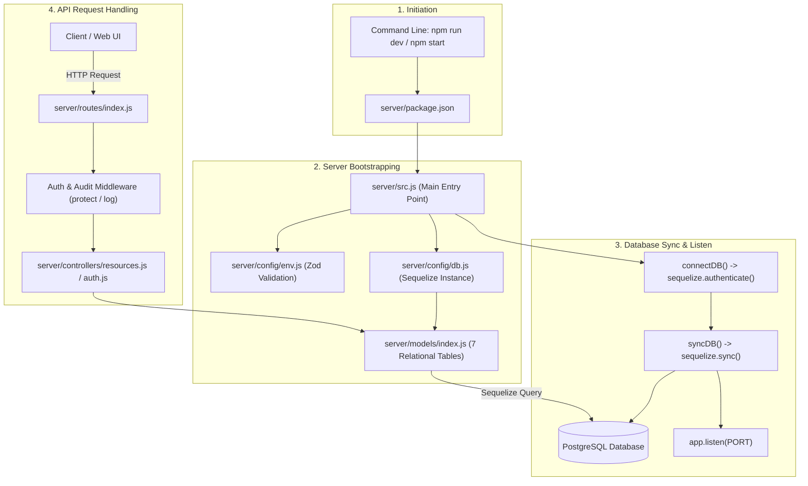

# MIST Avinya – Database & Server Architecture Flow Guide

A comprehensive architectural and technical reference documenting the complete lifecycle of server startup, file navigation, Sequelize ORM initialization, schema & table creation, request routing, and database seeding.

---

## 📑 Table of Contents
1. [High-Level Flow Diagram](#1-high-level-flow-diagram)
2. [End-to-End Execution Sequence](#2-end-to-end-execution-sequence)
3. [File-by-File Breakdown](#3-file-by-file-breakdown)
   - [A. Entry Point & Script Trigger](#a-entry-point--script-trigger)
   - [B. Environment Config & Validation](#b-environment-config--validation)
   - [C. Database Connection & ORM Instance](#c-database-connection--orm-instance)
   - [D. Model & Schema Definitions (Where Tables Live)](#d-model--schema-definitions-where-tables-live)
   - [E. Server Bootstrapping & Table Synchronization](#e-server-bootstrapping--table-synchronization)
   - [F. Request Routing to Database Queries](#f-request-routing-to-database-queries)
4. [Where and How the Database & Tables Are Created](#4-where-and-how-the-database--tables-are-created)
5. [Database Management & Utility Scripts](#5-database-management--utility-scripts)
6. [Quick Reference Commands](#6-quick-reference-commands)

---

## 1. High-Level Flow Diagram



---

## 2. End-to-End Execution Sequence

| Step | File / Component | Responsibility |
| :--- | :--- | :--- |
| **1** | [package.json](file:///c:/Users/dhruv.bathla/Desktop/admin-2/server/package.json) | NPM script invokes `nodemon src.js` or `node src.js`. |
| **2** | [src.js](file:///c:/Users/dhruv.bathla/Desktop/admin-2/server/src.js) | Loads environment variables and imports database connectors & route handlers. |
| **3** | [config/env.js](file:///c:/Users/dhruv.bathla/Desktop/admin-2/server/config/env.js) | Validates environment variables with Zod schemas and freezes the config object. |
| **4** | [config/db.js](file:///c:/Users/dhruv.bathla/Desktop/admin-2/server/config/db.js) | Instantiates the `Sequelize` client with connection pool and PostgreSQL dialect. |
| **5** | [models/index.js](file:///c:/Users/dhruv.bathla/Desktop/admin-2/server/models/index.js) | Defines all 7 database schemas, columns, constraints, indexes, and table associations. |
| **6** | [src.js](file:///c:/Users/dhruv.bathla/Desktop/admin-2/server/src.js) (`startServer`) | Calls `connectDB()`, then `syncDB()` (creates tables in Postgres), and finally starts Express `app.listen()`. |
| **7** | [routes/index.js](file:///c:/Users/dhruv.bathla/Desktop/admin-2/server/routes/index.js) | Dispatches incoming API requests to authenticated controllers. |
| **8** | [controllers/resources.js](file:///c:/Users/dhruv.bathla/Desktop/admin-2/server/controllers/resources.js) | Executes Sequelize queries against PostgreSQL and returns JSON to client. |

---

## 3. File-by-File Breakdown

### A. Entry Point & Script Trigger
- **File**: [`server/package.json`](file:///c:/Users/dhruv.bathla/Desktop/admin-2/server/package.json)
- **Action**: When running `npm run dev`, it launches nodemon with `src.js` as the target.
```json
"scripts": {
  "dev": "nodemon src.js",
  "start": "node src.js",
  "seed": "node scripts/seed.js",
  "db:sync": "node scripts/sync-db.js"
}
```

---

### B. Environment Config & Validation
- **File**: [`server/config/env.js`](file:///c:/Users/dhruv.bathla/Desktop/admin-2/server/config/env.js)
- **Action**: 
  - Loads `.env` via `dotenv`.
  - Validates `DB_HOST`, `DB_PORT`, `DB_NAME`, `DB_USER`, `DB_PASSWORD`, `DB_DIALECT`, `JWT_SECRET`, and `CLIENT_URL` using Zod schema.
  - Prevents server from starting if any required database parameter is missing or invalid.
  - Exports immutable, frozen configuration objects.

---

### C. Database Connection & ORM Instance
- **File**: [`server/config/db.js`](file:///c:/Users/dhruv.bathla/Desktop/admin-2/server/config/db.js)
- **Action**:
  - Creates the shared singleton `Sequelize` instance:
    ```javascript
    export const sequelize = new Sequelize(
      config.database.name,
      config.database.user,
      config.database.password,
      {
        host: config.database.host,
        port: config.database.port,
        dialect: config.database.dialect,
        timezone: config.database.timezone,
        logging: false,
        pool: { min: 2, max: 10, acquire: 30000, idle: 10000 },
        define: { timestamps: true, underscored: true }
      }
    );
    ```
  - Exports `connectDB()` (`sequelize.authenticate()`).
  - Exports `syncDB(options)` (`sequelize.sync(...)`).
  - Exports `transaction()` for atomic database transactions.

---

### D. Model & Schema Definitions (Where Tables Live)
- **File**: [`server/models/index.js`](file:///c:/Users/dhruv.bathla/Desktop/admin-2/server/models/index.js)
- **Action**: Defines all 7 relational tables and their foreign key constraints:

| Model Name | Database Table | Description |
| :--- | :--- | :--- |
| `User` | `users` | Portal administrators, managers, authentication credentials & roles. |
| `Employee` | `employees` | Staff profiles (emp_id, full name, phone number, designation). |
| `Device` | `devices` | Tracked mobile devices (serial number, status, assigned employee). |
| `CallLog` | `call_logs` | Metadata of all incoming/outgoing phone calls. |
| `CallFormData` | `call_form_data` | Client metadata associated with client calls (company, customer, reason). |
| `CallRecording` | `call_recordings` | S3 keys and local file playback paths for recorded audio calls. |
| `AuditLog` | `audit_logs` | Immutable audit trail capturing user actions, IP addresses, and payloads. |

**Relationships Defined**:
- `Employee` 1 : N `Device`
- `Employee` 1 : N `CallLog`
- `Device` 1 : N `CallLog`
- `Device` 1 : N `CallRecording`
- `CallLog` 1 : 1 `CallFormData`
- `CallLog` 1 : 1 `CallRecording`

---

### E. Server Bootstrapping & Table Synchronization
- **File**: [`server/src.js`](file:///c:/Users/dhruv.bathla/Desktop/admin-2/server/src.js)
- **Action**: The `startServer` async function coordinates the boot sequence:
  ```javascript
  const startServer = async (port) => {
    try {
      // 1. Authenticate PostgreSQL connection
      await connectDB();
      
      // 2. Sync database schema (Creates tables if not present)
      if (process.env.NODE_ENV === 'development') {
        console.log('🔄 Syncing database schema...');
        await syncDB({ alter: false });
      }

      // 3. Start listening for incoming HTTP connections
      const server = app.listen(port, () => {
        console.log(`🚀 Server listening on http://localhost:${port}`);
      });
    } catch (error) {
      console.error('❌ Failed to start server:', error.message);
      process.exit(1);
    }
  };
  ```

---

### F. Request Routing to Database Queries
- **Routes Entry**: [`server/routes/index.js`](file:///c:/Users/dhruv.bathla/Desktop/admin-2/server/routes/index.js)
- **Controllers**: [`server/controllers/resources.js`](file:///c:/Users/dhruv.bathla/Desktop/admin-2/server/controllers/resources.js) & [`server/controllers/auth.js`](file:///c:/Users/dhruv.bathla/Desktop/admin-2/server/controllers/auth.js)
- **Flow**:
  1. Route matching (e.g. `GET /api/calls`).
  2. Middleware verification (JWT token validation via `protect`, audit logging via `log`).
  3. Controller executes ORM queries (e.g. `CallLog.findAndCountAll(...)`).
  4. Response is sent back as structured JSON.

---

## 4. Where and How the Database & Tables Are Created

### 1. Database Creation (PostgreSQL Level)
The database itself (e.g. `mist_avinya_db`) exists at the PostgreSQL server layer. It is created either via:
- PostgreSQL CLI (`psql`):
  ```sql
  CREATE DATABASE mist_avinya_db;
  ```
- Or Docker container initialization (`docker-compose.yml`):
  ```yaml
  environment:
    POSTGRES_DB: mist_avinya_db
  ```

### 2. Table Creation (Sequelize Level)
Tables are created automatically through Sequelize in three possible ways:
1. **On Server Boot**: When `NODE_ENV === 'development'`, `startServer()` in [`server/src.js`](file:///c:/Users/dhruv.bathla/Desktop/admin-2/server/src.js) calls `syncDB({ alter: false })`.
2. **Via Sync Script**: Running `npm run db:sync` executes [`server/scripts/sync-db.js`](file:///c:/Users/dhruv.bathla/Desktop/admin-2/server/scripts/sync-db.js).
3. **Via Seed Script**: Running `npm run seed` executes [`server/scripts/seed.js`](file:///c:/Users/dhruv.bathla/Desktop/admin-2/server/scripts/seed.js).

---

## 5. Database Management & Utility Scripts

| File | Command | What It Does |
| :--- | :--- | :--- |
| [`server/scripts/sync-db.js`](file:///c:/Users/dhruv.bathla/Desktop/admin-2/server/scripts/sync-db.js) | `npm run db:sync` | Standalone script that connects to PostgreSQL and synchronizes all 7 tables without booting Express. |
| [`server/scripts/seed.js`](file:///c:/Users/dhruv.bathla/Desktop/admin-2/server/scripts/seed.js) | `npm run seed` | Syncs schema, cascades `TRUNCATE` across all tables, and inserts realistic sample users, employees, devices, calls, form submissions, recordings, and audit logs. |
| [`server/scripts/view-data.js`](file:///c:/Users/dhruv.bathla/Desktop/admin-2/server/scripts/view-data.js) | `npm run db:view` | Inspects and displays row counts and table summaries directly from PostgreSQL in the terminal. |
| [`server/scripts/generate-recordings.js`](file:///c:/Users/dhruv.bathla/Desktop/admin-2/server/scripts/generate-recordings.js) | `npm run recordings:generate` | Generates realistic sample audio WAV files in `server/public/recordings/` for local playback testing. |

---

## 6. Quick Reference Commands

```bash
# Navigate to server directory
cd server

# 1. Sync database schema (create tables)
npm run db:sync

# 2. Seed database with sample data
npm run seed

# 3. View database contents
npm run db:view

# 4. Generate local audio files for playback
npm run recordings:generate

# 5. Start dev server with nodemon
npm run dev
```
